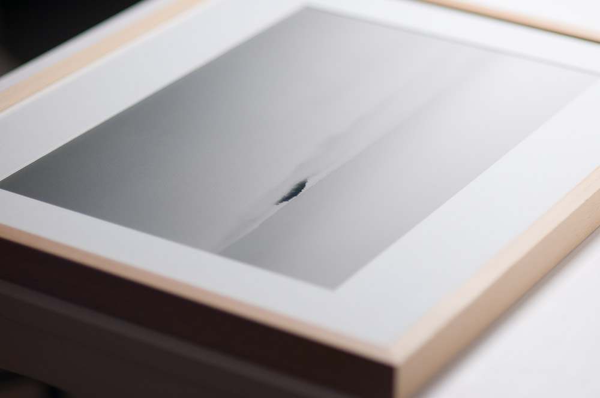

<figure id="attachment_2867" aria-describedby="caption-attachment-2867" style="width: 590px"><figcaption id="caption-attachment-2867"><a href="http://creativecommons.org/licenses/by-nc-nd/3.0/" target="_blank" rel="noopener noreferrer">Lluís Ribes i Portillo (cc)</a></figcaption></figure>

Del viernes 29 de mayo hasta el 23 de junio podéis visitar la exposición “**Tast de fotografía d’autor a Sant Cugat**” organizada por [Qgat-foto](https://www.facebook.com/pages/Qgat-Foto/1433711293549054?sk=photos_stream&ref=page_internal) y que fue presentada en marzo como parte de los eventos del año en homenaje al fotógrafo Pere Formiguera. En esta exposición **habrán 6 fotografías de mi proyecto [Atlántica](http://www.lluisribes.net/atlantica/exposicion-12-gats-2015/)**. La exposición se realiza en la [Galería Taller Dotze Gats](http://www.dotzegats.com/) , en la calle de l’Olivera, 18 del Poble Sec, en Barcelona y habrá una pequeña inauguración el **viernes 29 a las 19:30 horas** ([evento en facebook](https://www.facebook.com/events/545450252274067/)).

Estáis invitados.  
[Atlántica](http://www.lluisribes.net/atlantica/exposicion-12-gats-2015/) es solo uno de los siete proyectos de autores de la ciudad de Sant Cugat que se presentan y que son:

-   **Jordí Camí**: “Beirut, Rebuilding Dreams”
-   **Llorenç Pié**: “Minimals”
-   **Maite Llasera y Joan Roig**: “Journal Lia Gabashbili”
-   **Miquel Abat**: “En Via Morta”
-   **Carles Cabanas**: “Altres Realitats”
-   **Pep Pujol**: “Retrato de una mujer en la cocina”

Podéis visitar el siguiente artículo donde hablo con más detalle de cada uno de ellos y podéis ver algunas de sus fotografías: [“Fotografia d’autor” en Sant Cugat del Vallès](http://www.lluisribes.net/blog/2015/01/fotografia-d-autor-en-sant-cugat-del-valles.html)