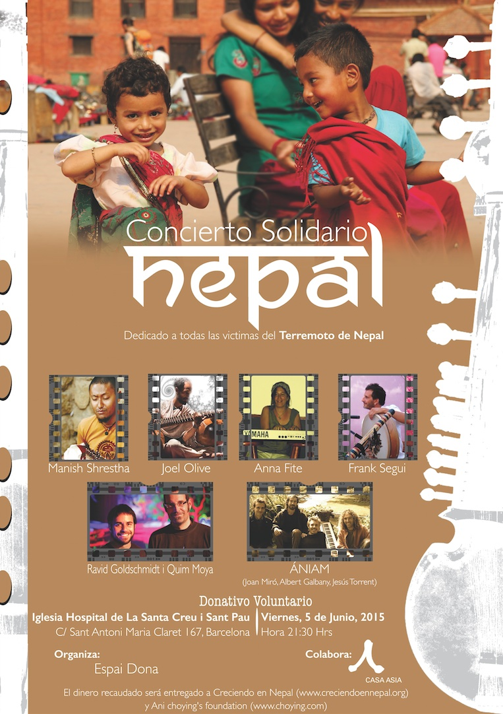

<figure id="attachment_2870" aria-describedby="caption-attachment-2870" style="width: 290px"><figcaption id="caption-attachment-2870">Haz click sobre el póster para verlo en grande</figcaption></figure>

Este viernes **5 de junio a las 21:30** horas se realiza un **concierto solidario por las víctimas de los últimos terremotos en Nepal**. El concierto se realiza en la [Iglesia Hospital de la Santa Creu i Sant Pau](https://goo.gl/maps/VJGJD), en Barcelona (**línea L4** de metro).

Es un concierto de artistas que inspiran **tradición musical nepalesa, mantras, música meditativa y artes pictóricas**.

La entrada es el donativo voluntario que cada uno quiera aportar y la recaudación se entregará a las asociaciones [Creciendo en Nepal](http://creciendoennepal.org/) y [Ani Choying’s foundation](http://www.theanifoundation.org/news-interviews.html) que gestionarán este dinero para las familias nepalíes.

La página del evento en **Facebook** [aquí](https://www.facebook.com/events/1591666397760452/permalink/1600522350208190/).

Los Terremotos
--------------

El 25 de Abril de 2015 el Nepal sufrió el mayor terremoto desde el año 1934. Este terremoto causó más de **8,800 muertes y 23,000 heridos** y la tragedia continúa primero porque las réplicas del terremoto (una de ellas especialmente violenta el 12 de mayo)  todavía suceden pero sobretodo por los escasos recursos que ya de por sí tiene el país y sus ciudadanos. Las infraestructuras y servicios  han quedado fuertemente dañados y muchas familias viven en campamentos improvisados en solares abandonados. Otro lamentable dato son **las 8.000 escuelas que han sido destruidas a raíz de esta tragedia**.

A pesar que ha tenido una gran repercusión mundial esta catástrofe y una gran movilización de la comunidad internacional todavía se necesita ayuda y más que nunca ahora que no está en el foco de los medios de comunicación generales.

De esta forma este concierto permitirá canalizar aquella ayuda que queráis aportar todavía más a las familias del Nepal .

\[metaslider id=2879\]

Más información:

-   *Wikipedia*: [http://en.wikipedia.org/wiki/April\_2015\_Nepal\_earthquake](http://en.wikipedia.org/wiki/April_2015_Nepal_earthquake)
-   *Imágenes posteriores del terremoto*: [http://commons.wikimedia.org/w/index.php?search=Earthquake+nepal&title=Special%3ASearch&go=Ir&uselang=es](http://commons.wikimedia.org/w/index.php?search=Earthquake+nepal&title=Special%3ASearch&go=Ir&uselang=es)

El concierto
------------

El concierto está organizado por **[Espai Dona](https://www.facebook.com/espai.dona.3?lst=100005321136098%3A100005606641020%3A1433084973)** y colabora la **[Casa Asia](http://www.casaasia.es/)**. Se realizará en un bonito escenario como es la Iglesia del Hospital de la Santa Creu i Sant Pau. Es una iglesia del **recinto modernista del Hospital de Sant Pau** declarado patrimonio de la humanidad por la [Unesco](http://www.unesco.org/new/es). Sus dimensiones son muy grandes por tratarse de una iglesia de un hospital y pese que no se sitúa en las construcciones de la primera etapa del complejo donde el arquitecto [Lluís Domenech i Montaner](http://es.wikipedia.org/wiki/Llu%C3%ADs_Dom%C3%A8nech_i_Montaner) fue el máximo responsable dejando huella de un modernismo en todo su esplendor, la iglesia bebe de esa fuente y a pesar de ser un modernismo más austero es igual de sobrecogedor.

-   *Del Hospital de Sant Pau y de su iglesia podéis obtener más información en*: [http://www.santpaubarcelona.org/](http://www.santpaubarcelona.org/)

### Los artistas

Los artistas que participarán realizarán **actuaciones musicales y** alguna **pictórica** que nos trasladarán directamente al Nepal. Artistas que trabajan esos sonidos tan singulares de meditación, mantras, relajación, paz y amor. Os dejo una recopilación personal de Youtube con vídeos musicales de algunos de los artistas que participarán y luego un pequeña descripción de cada uno de ellos.

### Lista de reproducción

httpv://www.youtube.com/playlist?list=PLGMeyNe2BbmN6OGYqrpvl0H\_3iGoWzrbZ

### Artistas

-   **[Manish Shrestha](https://www.facebook.com/pages/Manish-Shrestha/151677438249305)**: artista, compositor productor de música de fusión occidental con la música india. A través de su web tenéis más información así como disponibles canciones suyas: [http://www.manish.es](http://www.manish.es) .
-   **[Joel Olivé](https://www.facebook.com/pages/Joel-Oliv%C3%A9-Cruz/191986020861634)**: músico profesional que usa la música y el sonido como herramienta de crecimiento interior y desarrollo humano. Mucha más información y también tracks de audio en su web: [http://www.joelolive.com/](http://www.joelolive.com/) 
-   **[Ravid Goldschmidt](https://www.facebook.com/ravidgoldschmidt)** y **[Quim Moya](https://www.facebook.com/quimmoya)**: Ravid es un virtuoso del instrumento Hang tocándolo por toda Europa y buscando nuevas fronteras de este instrumento tan reciente. Su página web recoge información de su discografía, actuaciones y también unas pinceladas para comenzar a tocar el Hang: [https://ravidgoldschmidt.wordpress.com](https://ravidgoldschmidt.wordpress.com)/ . También podemos encontrarlo dando una sesión de TEDx sobre su música en : [http://tedxtalks.ted.com/video/TEDxUIMP-Ravid-Goldschmidt-Aper](http://tedxtalks.ted.com/video/TEDxUIMP-Ravid-Goldschmidt-Aper)  . Pero en este concierto irá acompañado de Quim Moya artística showman pictórico que se define como el pintor más rápido del mundo. La actuación una fusión entre pintura y música… En la web de Quim podréis intuir el show:  [https://quimmoyalivepainting.wordpress.com](https://quimmoyalivepainting.wordpress.com) aunque la improvisación permitirá el factor sorpresa
-   **[Àniam](https://www.facebook.com/pages/%C3%80NiAM/327687877323709)**: grupo de fusión de música tradicional y de vanguardia formado por [Joan Miró](https://www.facebook.com/joan.miroprat?fref=pb&hc_location=friends_tab), [Albert Galbany](https://www.facebook.com/albert.gimenez.549) y Jesús Torrent con un disco publicado L’arbre que es un proyecto muy reciente lleno de música experimental.

Espero haber facilitado información suficiente para que volvamos a pensar en el trágico terremoto del Nepal y sus consecuencias y dar a conocer esta interesantísima propuesta de colaborar asistiendo al concierto del viernes y dejando un donativo que irá a la lucha para la recuperación del país. **Es sin duda una buena propuesta solidaria, cultural y abierta a todos los públicos.**