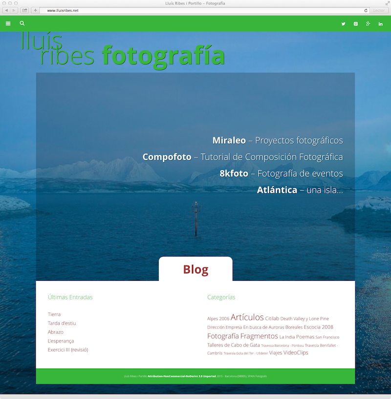
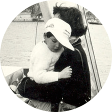

  
Hola!  
hoy ya se ha activado las nuevas modificaciones de la web y del blog [http://www.lluisribes.net](http://www.lluisribes.net). A parte de actualizar todos los componentes para que sea más seguro y rápido navegar por él, los cambios más significativos son:

-   Una remodelación integral de la página principal con fotografías mías de fondo como pase de diapositivas.
-   En el menú desplegable del córner superior izquierdo se ha modificado las secciones y ahora aparece *Poemas*, que son aquellos artículos con poemas que he escrito y también aparece *Fragmentos* que son textos de autores que acostumbro a acompañar con fotos.
-   En el blog, la barra de la derecha aparecen las listas clásicas de categorías del blog y nubes de las etiquetas.
-   Desaparece la caja del *Twitter*, pero siempre me podréis seguir allí en [https://twitter.com/lluisribes](https://twitter.com/lluisribes)
-   Se añade un nuevo icono social: *Pinterest* . Si estáis en Pinterest me podéis seguir en [https://www.pinterest.com/ribeslluis/](https://www.pinterest.com/ribeslluis/)

Y recordar, **si queréis recibir las notificaciones automáticas de los nuevos artículos del blog, podéis subscribiros en *Subscríbete Al Blog*** situado en el córner superior derecho o abajo en los dispositivos móviles. Tan solo hay que poner el mail y confirmar un correo electrónico que llegará a tu buzón. De esta forma podrás recibir las novedades del blog puntualmente a través del correo de forma automática.

**Gracias!!**

