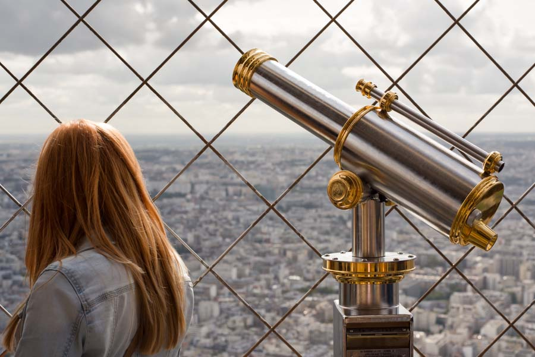

<figure id="attachment_3017" aria-describedby="caption-attachment-3017" style="width: 890px"><figcaption id="caption-attachment-3017">París, 2015 – <a href="http://creativecommons.org/licenses/by-nc-nd/3.0/" target="_blank" rel="noopener noreferrer">Lluís Ribes i Portillo (cc)</a></figcaption></figure>

> [\[…\]](http://seriealfa.com/varia/varia1/gildebie.htm)
> 
> y aquel viaje -camino de la cama-
> 
> en un vagón del Metro Étoile-Nation.

###### [Jaime Gil de Biedma](https://ca.wikipedia.org/wiki/Jaime_Gil_de_Biedma), *“París, postal del cielo”*