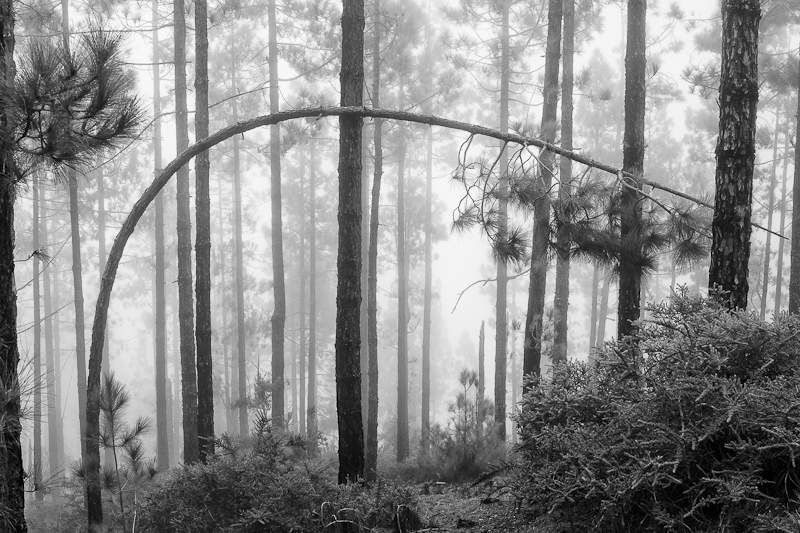
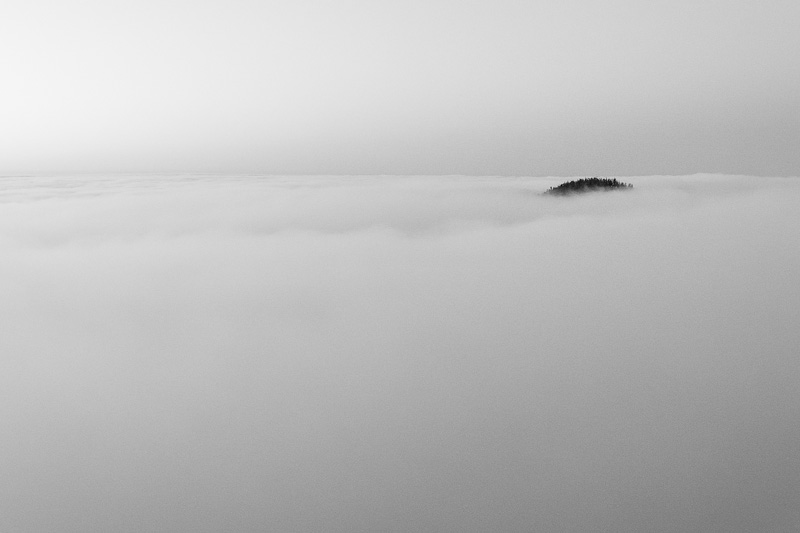

Este **jueves 29** en Madrid se inaugura la [IV Exposición Benéfica de Arte](http://www.fundacionpablo.org/ARTE) organizada por la [Fundación Pablo Horstmann](http://www.fundacionpablo.org/) en colaboración con la [Galería de Arte Lucía Mendoza](http://www.luciamendoza.es/).

En esta exposición habrán obras de pintura, fotografía y escultura a la venta y **cuya recaudación se destinará íntegramente al [Hospital Pediátrico de Anidan en Kenia](http://www.fundacionpablo.org/index.php/proyectos/hospital-pediatrico-lamu)** que tiene la fundación.

La inauguración se realizará en:

Galería Lucía Mendoza
---------------------

#### 29 Octubre a las 19:30

#### Calle Barbara de Braganza 10 – Madrid

La exposición estará solo hasta el 1 de Noviembre. Os invito a que no dejéis pasar la oportunidad de disfrutar de la expo y que **podáis adquirir una obra que os conmueva y sobretodo con ello ayudar a la fundación** en su trabajo en la mejora de las condiciones infantiles en el distrito keniano de Lamu.

Entre las obras a adquirir habrán dos fotografías de mi proyecto [ATLÁNTICA](http://www.lluisribes.net/atlantica/) en un formato exclusivo de 55 cm. x 36 cm en unos bonitos marcos con acabados de madera. Podéis conocer más sobre los artistas que participan aquí: [http://www.fundacionpablo.org/ARTE/index.php/exposicion/artistas](http://www.fundacionpablo.org/ARTE/index.php/exposicion/artistas)  
  
