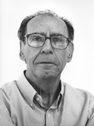

<figure style="width: 185px"><figcaption>© Txema Salvans</figcaption></figure>

Hola,

Fa unes setmanes al curs de poesia de l’[Ateneu Barcelonès](http://www.ateneubcn.org/) vam rebre la visita del poeta [Jordi Pàmias](http://www.escriptors.cat/autors/jpamias/pagina.php?id_sec=1358) qui ens va fer una classe magistral després que tots ens haguéssim llegit el seu llibre [“Terra, mite, àngel” (Pagès editors)](http://pageseditors.cat/CAT/llibre_milenio2.asp?idf=12&id=6&id_llibre=1963) que recull tres de les seves obres més destacades: *Terra cansada (2004), Narcís i l’altre (2001) i La veu de l’àngel (2008).*

Un dia diferent i privilegi de poetes poder compartir aquell temps i espai amb ell.

Arran d’aquella trobada, us deixo una recopilació de vídeos d’una entrevista que li va fer la [Institució de les  Lletres Catalanes](https://www.youtube.com/user/lletrescatalanes), una entrevista que repassa tota la vida del poeta, tota la seva obra i a on recita un bon grapat dels seus poemes.

Complementant al vídeo, us deixem un qüestionari que vam recollir el grup d’alumnes (autoanomenats “*Set poetes té el pomer*“) amb preguntes pel Jordi Pàmias que respongué molt amablement:

* * *

Qüestionari de preguntes dels alumnes de la classe “Set Poetes Té El Pomer” al poeta Jordi Pàmias.

Primer curs d’escriptura de poesia a Escola d’Escriptura de l’Ateneu Barcelonés (2015-2016)

1.  **Com defineixes la poesia, en poques paraules?** 

Un art verbal que, mitjançant la connotació en les paraules, el joc de les imatges i un ritme musical, té com a objectiu la creació de bellesa.  
 

2.  **Com va aprendre l’ofici de poeta? Quin paper va jugar l’aprenentatge de la tècnica a la seva evolució?** 

En la meva adolescència, em fascinaven la tècnica del vers i la sonoritat de les paraules. Hi va fer un paper fonamental -que anà minvant a mesura que l’assimilava  
 

3.  **Si hagués d’enumerar un seguit de perills pel poeta (sigui el que comença o aquell que ja ho és des de fa temps) quins serien? Serien gaire diferents dels que identificaria per a qualsevol persona?** 

L’autocomplaença narcisista. S’han de tenir els ulls ben oberts a la bellesa del món. I la ment disposada al diàleg. Això es pot aplicar a qualsevol persona. No serà mai madura si no venç el narcisisme.  
 

4.  **Té la sensació que ha necessitat la poesia al llarg de la seva vida o que és una companya més del viatge?** 

Per a mi la poesia ha estat absolutament necessària.  
 

5.  **Quin poeta diria que és el que més ha influenciat la teva poesia?** 

Poetes diferents, en diferents etapes de la meva vida. Potser perquè he estat professor de literatura espanyola, m’ha influït Antonio Machado. Admiro molt Virgili, Baudelaire, Rilke…  
 

6.  **Quan escriu ho fa voltat de silenci o utilitza alguna vegada la música de fons mentre escriu?** 

Sempre en silenci.  
 

7.  **Què va suposar la seva jubilació a la seva obra poètica?**

Un gran avantatge: molt temps lliure -que he dedicat a la creació i a la revisió de la meva obra.  
 

8.  **Diu en algunes entrevistes que ha intentat seguir sempre els corrents poètics coetanis. Ho fa perquè s’ha sentit obligat a adaptar-se a les noves corrents o perquè es sentia part d’elles?** 

Em sento deutor d’una tradició poètica, que ha evolucionat i ha canviat amb el relleu de les generacions.  
 

9.  **Vostè va decidir escriure en català perquè era una llengua que estava en una clara posició de desaparèixer. Si avui comences a escriure, tornaria a prendre la mateixa decisió?** 

Sí, sens dubte.  
 

10.  **A la seva obra hi veiem fonts d’inspiració com la terra, la natura, la mitologia, elements bíblics…etc. Què més li ha inspirat a l’hora d’escriure poesia?**

La bellesa del món, la presència de Déu i la complexitat de la relació amorosa. També una viva consciència del pas del temps.  
 

11.  **Considera que al començament s’escau més intentar imitar aquells que ens són més propers o que això pot ser una oportunitat perduda, potser perquè a aquells més propers sempre podrem accedir en un altre moment?**

És fonamental la tradició literària. Per a mi, van ser propers Verdaguer, Maragall, Carner… I una obra magnífica: “Mireia”, de Frederic Mistral.  
 

12.  **En Joan Margarit afirma que “tota poesia neix d’un esclat”. Vostè podria compartir aquesta afirmació? Per exemple el primer poemari seu neix d’un amor fallit però altres poemes potser més a prop de la poesia històrica, podrien venir més d’una reflexió pausada i no tant d’un esclat?** 

La meva poesia neix molt sovint d’un record que em commou. A vegades, d’una experiència col·lectiva intensament compartida.  
 

13.  **Quan arriba la convicció que s’ha aconseguit una veu pròpia? És quelcom que depèn de l’opinió del lector, de sentir que per fi s’aconsegueix expressar adequadament el que es vol dir o mai s’arriba a saber totalment?** 

Aconseguir una veu pròpia no és fàcil. Cal superar influències massa concretes, conèixer a fons la llengua i escriure per pura necessitat interior.  
 

14.  **Al fil de l’anterior pregunta, es cura la insatisfacció per no aconseguir expressar plenament el que es vol dir? És com la maduresa personal en el sentit d’entrar en fase d’acceptació de les mateixes limitacions?**

La insatisfacció es pot curar revisant amb rigor la pròpia obra. Cal fer-ho fredament i al cap d’un temps de silenci.  
 

15.  **Al poema *Banalitat* diu que sense sofriment l’home no madura. El sofriment ha fet madurar la seva poesia?**

Sí. Va influir directament en la meva primera obra extensa: Plany fosc vora la mar (Obra poètica I : “La casa dels avis”).  
 

16.  **En el llibre *La Veu de l’Àngel* diu que l’home ja madur és enganyat per la calma. La maduresa ha calmat també la seva poesia?**

La maduresa m’ha fet més lúcid i segur, en el moment de revisar els poemes.  
 

17.  **A *Terra Cansada* hi ha molts poemes amb rima consonant que no segueixen estructures mètriques clàssiques. No passa en altres parts del llibre que percebo com més existencials. La meva sensació és que la rima es posa al servei de la descripció del paisatge i que el seu major formalisme en alguna mesura separa el poema de l’interior de l’autor. És aquesta una percepció correcta? El rigor formal pot treure passió a continguts més íntims i emocionals, o pel contrari, emfatitzar-los al trobar-se’ls encotillats en estructures menys còmodes. O és indiferent i al final és un tema de virtuosisme?** 

La teva sensació és encertada. La rima és un risc i pot contribuir al formalisme buit, en un poema. Millora la música d’un vers; però cal aconseguir una difícil naturalitat. Lliga més amb el concepte de poesia com a joc.  
 

18.  **A *Contemplació* la figura de Narcís és una figura que no se sent sola, se sent forta fins que l’amor arriba. Quina força té l’amor a la vida, pot considerar-se com reflex del misteri?** 

L’amor, com a pulsió del sexe i com a reflex del misteri vital, ocupa un lloc central en la poesia lírica.  
 

19.  **Quan comença a sentir a Narcís dins seu?**

En la difícil adolescència. I es va retirar lentament…  
 

20.  **En tots tres llibres – sobretot en el de *Terra Cansada*\-, així com en altres poemes seus, l’enyor és molt present; a la meva escassa experiència pràctica escrivint versos, sovint detecto que determinats sentiments es fan molt presents no tant en paraules o temàtica com en un àmbit més subtil, com una tendència més general o de conjunt, quelcom que vola per sobre o per sota dels versos. Què m’aconsellaria per intentar trencar amb això?**

En efecte, l’enyor -un aspecte del record- hi és molt present. No s’ha de trencar amb això. Aquest “àmbit més subtil” és la gràcia de la poesia.  
 

21.  **Sovint trobo, en versos, veus alienes que m’agraden molt però que són molt llunyanes a l’embrió de la que suposadament m’he de guanyar per tenir-ne una. Fins a quin punt aconsellaria provar d’integrar aquests llocs des d’on un altre escriu que ens són tan estrany**s?

Cal acceptar conceptes o “estils” de poesia diferents del teu, amb un sa eclecticisme. La veu pròpia l’aconseguiràs amb el pas dels anys. Això sí: és essencial viure la poesia amb passió i al marge de les modes.  
 

22.  **Pot enumerar-nos cinc paraules del diccionari que li evoquin poesia.**

Record, neu, primavera, amor, música.