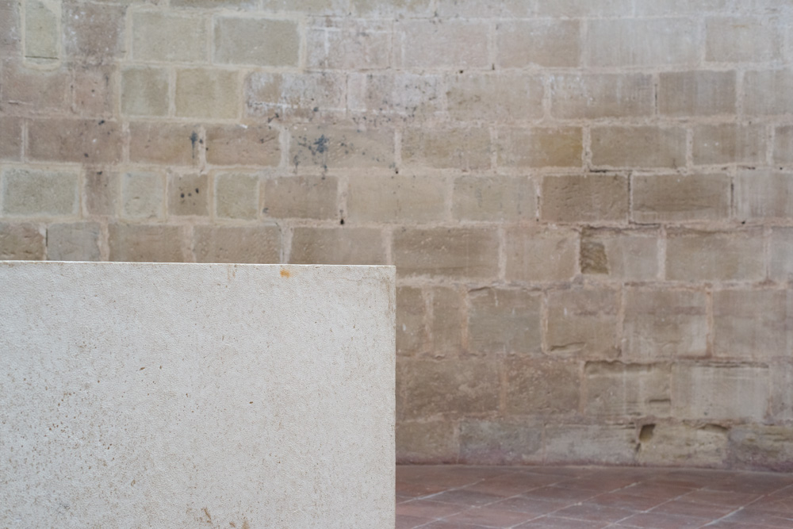

<figure id="attachment_3255" aria-describedby="caption-attachment-3255" style="width: 990px"><figcaption id="caption-attachment-3255">Cañas – <a href="https://creativecommons.org/licenses/by-nc-nd/3.0/" target="_blank" rel="noopener noreferrer">Lluís Ribes (cc)</a></figcaption></figure>

  
 

No es que las piedras sean mudas;  
sólo guardan silencio.

##### **Piedras** – [Humberto Ak’abal](https://es.wikipedia.org/wiki/Humberto_Akabal)