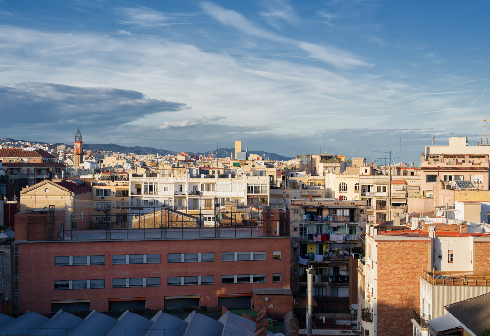

<figure id="attachment_3571" aria-describedby="caption-attachment-3571" style="width: 1490px"><figcaption id="caption-attachment-3571">Barri de Barcelona – <a href="https://creativecommons.org/licenses/by-nc-nd/3.0/" target="_blank" rel="noopener noreferrer">Lluís Ribes i Portillo (cc)</a></figcaption></figure>

**En Mi Ciudad Algún Día**

Yo viviré algún día  
el rojo vino; el aire  
de tu recuperada  
libertad y saldré  
por tus calles cantando  
cantando hasta quedarme  
sin voz -porque serás  
de nuevo y para siempre-  
albergue de extranjeros  
hospital de los pobres  
patria de los valientes  
tú, Laye, mi ciudad.

[José Agustín Goytisolo](https://es.wikipedia.org/wiki/Jos%C3%A9_Agust%C3%ADn_Goytisolo)