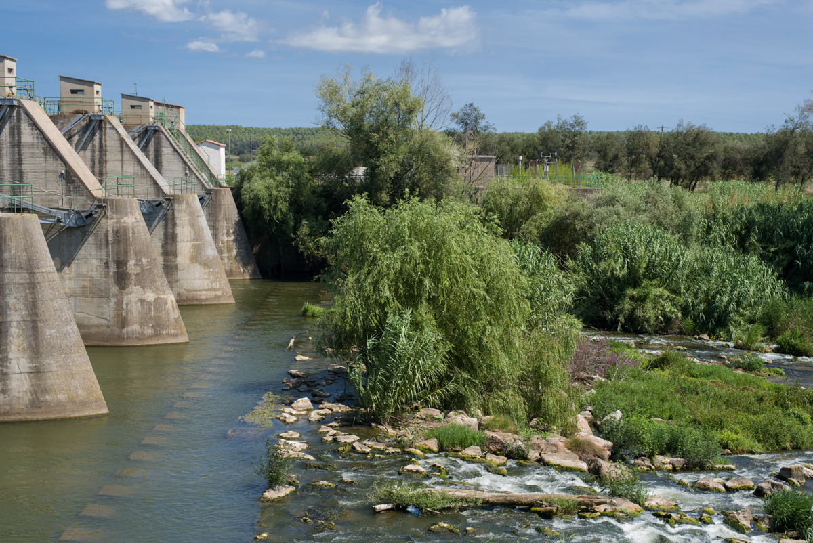

<figure id="attachment_3575" aria-describedby="caption-attachment-3575" style="width: 1190px"><figcaption id="caption-attachment-3575">Resclosa de Colomers – <a href="https://creativecommons.org/licenses/by-nc-nd/3.0/" target="_blank" rel="noopener noreferrer">Lluís Ribes i Portillo (cc)</a></figcaption></figure>

**Aviones de papel**

Es posible doblar  
Una hoja de papel  
Con esmero  
En los puntos indicados

Doblar desdoblar  
Volver a doblar  
Repetir el pliegue  
Varias veces

Hasta alcanzar  
La forma deseada  
Exhalar aire tibio  
Sobre la punta

Finalmente lanzar  
Lejos de uno  
O sobre un arbusto  
Y esperar que vuele

Pero el método  
Verdaderamente noble  
Es doblar el viento  
En los puntos indicados

Doblar desdoblar  
Volver a doblar

Lanzar contra  
Una hoja de papel

Y no esperar nada

[Mario Montalbetti](https://es.wikipedia.org/wiki/Mario_Montalbetti)