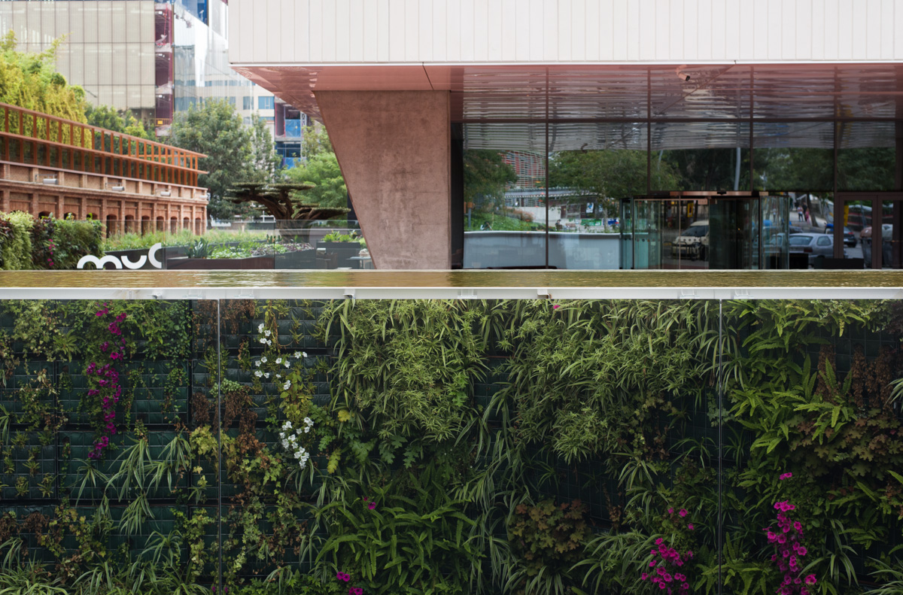

<figure id="attachment_3581" aria-describedby="caption-attachment-3581" style="width: 1190px"><figcaption id="caption-attachment-3581">Carrer Bolivia amb Badajoz – <a href="https://creativecommons.org/licenses/by-nc-nd/3.0/" target="_blank" rel="noopener noreferrer">Lluís Ribes i Portillo (cc)</a></figcaption></figure>

夏川や  
橋はあれども馬  
水を行く

[Masaoka Shiki](https://es.wikipedia.org/wiki/Masaoka_Shiki)

*El riu baixa a l’estiu*  
*hi ha un pont, però el cavall*  
*creua per l’aigua.*