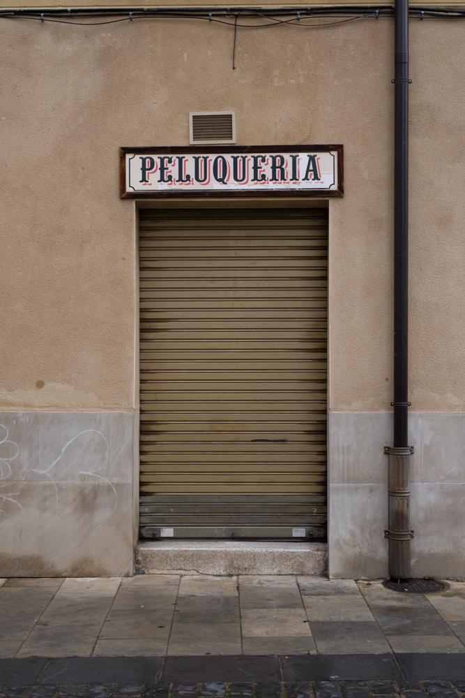

<figure id="attachment_3619" aria-describedby="caption-attachment-3619" style="width: 657px"><figcaption id="caption-attachment-3619">Peluquería – <a href="https://creativecommons.org/licenses/by-nc-nd/3.0/" target="_blank" rel="noopener noreferrer">Lluís Ribes i Portillo (cc)</a></figcaption></figure>

**Canto a la nube**

tú que en estos versos naces  
en morada de los peces

tú que subes por las faldas  
y lloran todas sus ramas

tú que emanas la bebida  
sobre las frágiles raíces

tú que lustras adoquines  
entre aquellas calles grises

tú que sobre los desiertos  
te escondes tras los silencios

tú que a nuestra vieja luna  
velas de plata tul.

¿qué paisaje te cobija  
cuando este poema termina?

MP3jPLAYLISTS.inline\_4 = \[ { name: "canto\_a\_la\_nube", formats: \["mp3"\], mp3: "aHR0cDovL3d3dy5sbHVpc3JpYmVzLm5ldC93cC1jb250ZW50L3VwbG9hZHMvMjAxNy8xMi9jYW50b19hX2xhX251YmUubXAz", counterpart:"", artist: "", image: "", imgurl: "" } \]; MP3jPLAYERS\[4\] = { list: MP3jPLAYLISTS.inline\_4, tr:0, type:'single', lstate:'', loop:false, play\_txt:'&nbsp;&nbsp;&nbsp;&nbsp;&nbsp;', pause\_txt:'&nbsp;&nbsp;&nbsp;&nbsp;&nbsp;', pp\_title:'', autoplay:false, download:false, vol:100, height:'' };

Lluís Ribes i Portillo