Aquest cap de setmana s’ha fet la renovació de la web després del darrer canvi el 2015. Molts canvis interns i tecnològics i també d’estructuració. Primer us comentaré els canvis d’estructuració i després els que fan referència a tecnologia del web.

Estructuració
-------------

### 3 seccions

Torna al format de bloc, és a dir, la pàgina inicial **www.lluisribes.net** torna a tenir els darrers articles escrits com a contingut principal. L’objectiu és facilitar l’accés més ràpid del contingut que més es consumeix com són els darrers articles publicats. I també per facilitar la lectura, **s’elimina la càrrega infinita**; torna la paginació que ens permet arribar als articles més antics d’una forma més còmoda. Però es manté en el racó superior dret un botó que ofereix informació meva a Internet així com un accés directe a les **tres categories principals [Poemes](https://www.lluisribes.net/category/poemes/), [Fotos](https://www.lluisribes.net/category/fotos/) i [Viatges](https://www.lluisribes.net/category/viatges/)**. Aquestes tres categories, són les categories d’articles que aquests últims anys han tingut més presència:

<figure>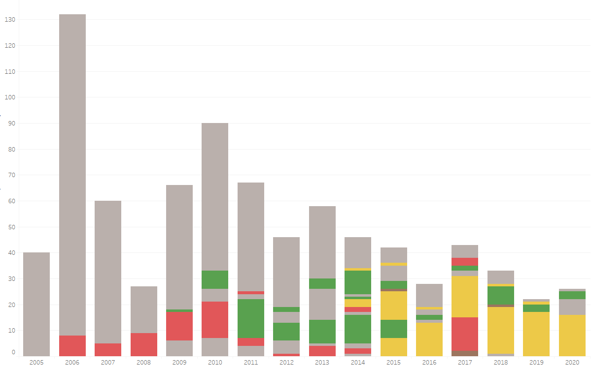<figcaption><strong>Total d’articles</strong> Vermell: Viatges | Verd: Fotos | Groc: Poemes</figcaption></figure>

A més a més, per cada una d’aquestes categories s’ha creat una secció al web adaptada a la consulta del seu contingut.

### Nou cercador

I la darrera millora respecte a l’estructuració és la incorporació d’un **nou cercador** que mostra resultats alhora que introdueixes les paraules de cerca, permet fer servir filtres i pot ser predictiu. Aquest cercador està disponible amb una configuració especial a cada una de les tres seccions anteriors per obtenir resultats més precisos.

<figure>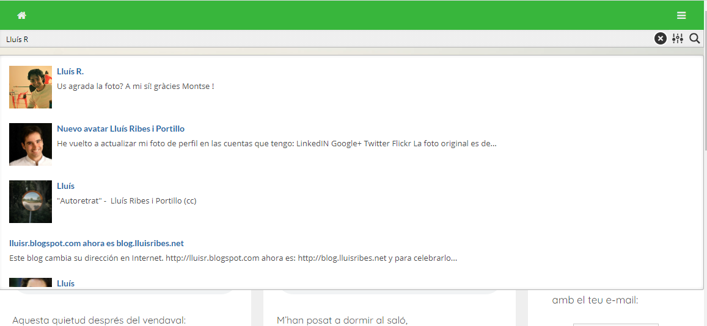<figcaption><strong>Nou cercador</strong></figcaption></figure>

Amb l’estructura tot l’altre queda igual: la **possibilitat de Subscripció** perquè us arribi una notificació al correu dels nous articles, un **disseny minimalista** totalment **responsiu al mòbil** i la secció [**Arxiu**](https://www.lluisribes.net/archivo/) a on (a part del cercador millorat) podeu trobar els més de 830 articles creats aquests quinze anys.

<figure>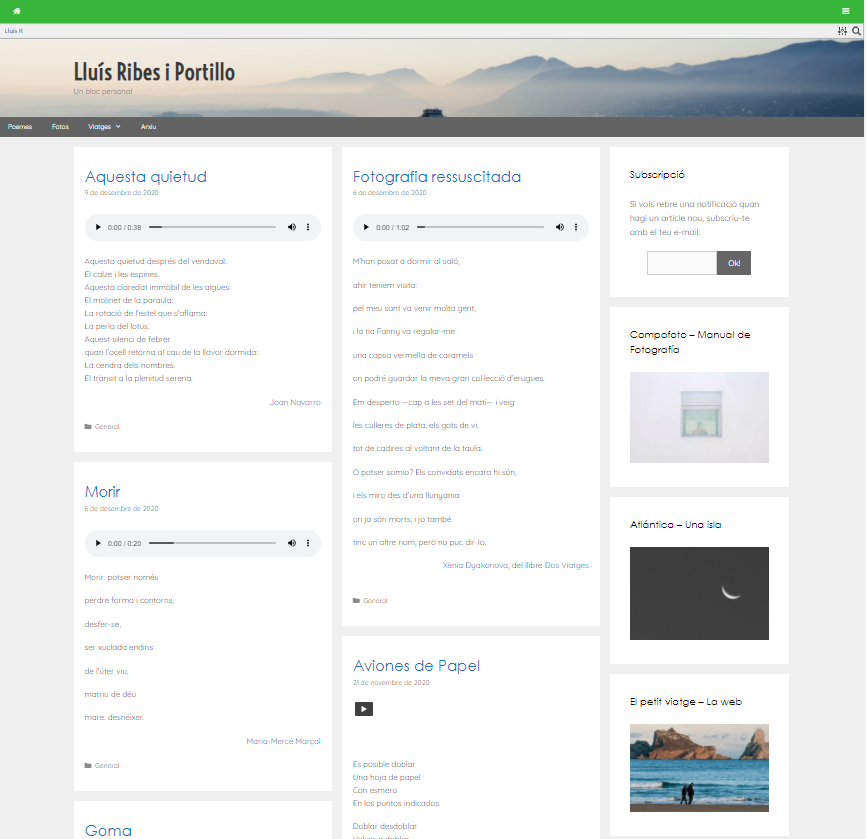<figcaption><strong>Visualització escriptori</strong></figcaption></figure>

<figure>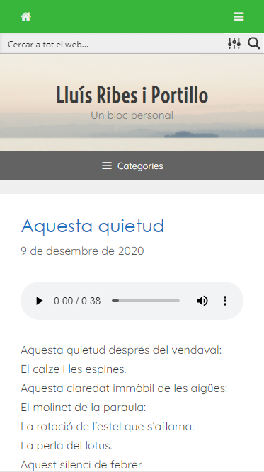<figcaption><strong>Visualització mòbil</strong></figcaption></figure>

### Anàlisis

I abans d’anar als canvis tecnològics, us comparteixo dades dels articles.

Amb diferència l’any que vaig escriure més articles va ser el 2006 i el que menys l’any passat 2019:

<figure>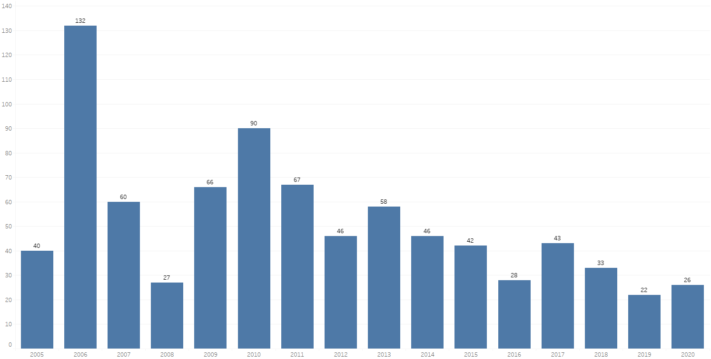<figcaption><strong>Articles per any</strong></figcaption></figure>

Els mesos que més he escrit en aquests quinze anys són els de tardor i hivern (destaca una mica agost).

<figure>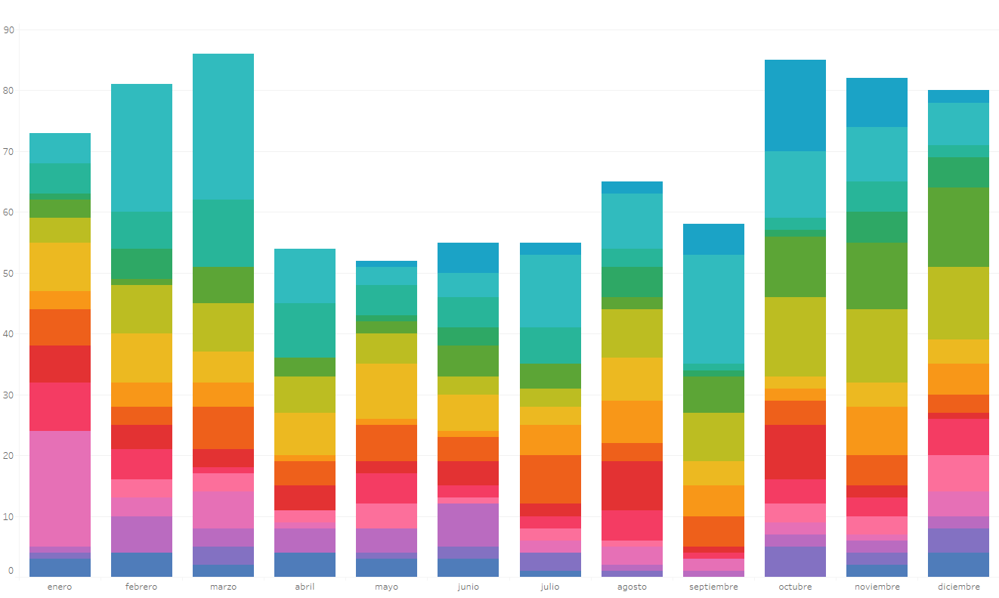<figcaption><strong>Articles per mes</strong> cada color és un any</figcaption></figure>

<figure>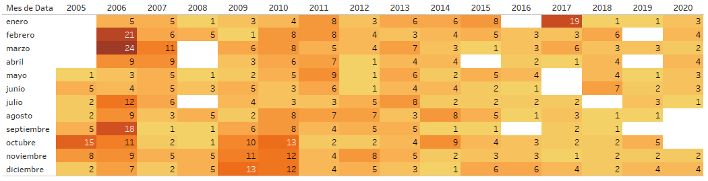<figcaption><strong>Articles segons el mes i l’any</strong> amb temperatura de color</figcaption></figure>

El dia de la setmana que més he publicat és el diumenge i el que menys el divendres (per què serà?).

<figure>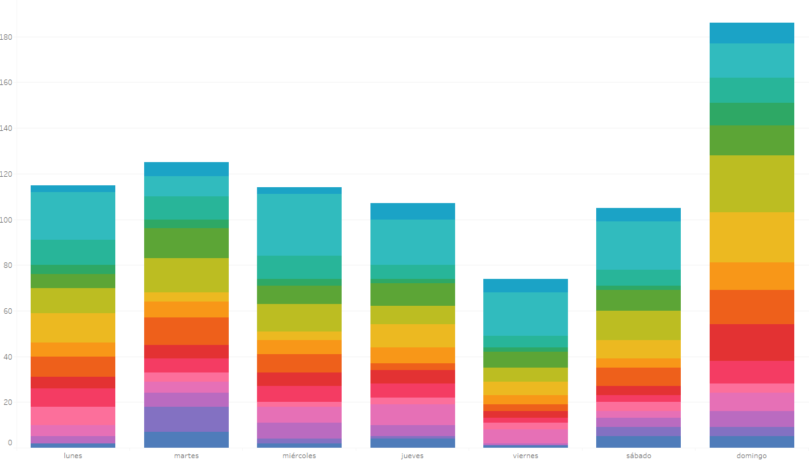<figcaption><strong>Articles per dia de la setmana</strong> cada color és un any</figcaption></figure>

<figure>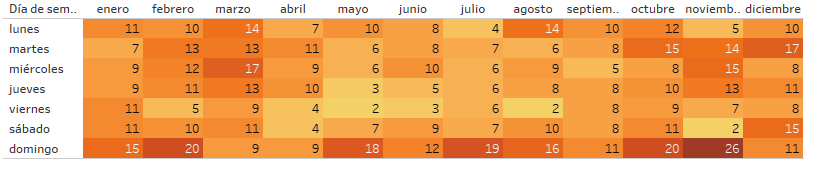<figcaption><strong>Articles segons el dia i el mes</strong> amb temperatura de color</figcaption></figure>

I si situem les etiquetes que localitzen geogràficament molts dels articles surt el següent mapa:

<figure>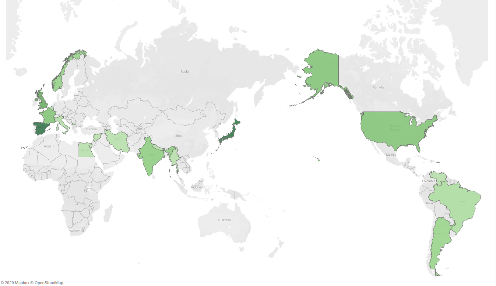<figcaption><strong>Situació geogràfica d’etiquetes</strong></figcaption></figure>

Tecnologia
----------

Respecte a la tecnologia hi ha hagut canvis més profunds. Des del 2015 el web està allotjat per mi (abans estava a la plataforma de blocs [Blogger](https://www.blogger.com)) i per tant no només m’encarrego d’escriure articles i estructurar-los sinó de gestionar l’allotjament que executa el codi del web i emmagatzema totes les dades perquè estigui 24/7 funcionant. I ja porta uns quants canvis al respecte. Aquest cop, **tota la web continua al mateix allotjament** (és a dir, servidors) situats a Alemanya, però internament hi ha hagut un petit sidral.

### HTTPS

Definitivament s’ha **activat per defecte la comunicació segura i confidencial [HTTPS](https://ca.wikipedia.org/wiki/HTTPS)** entre el navegador (com el que ara estàs fent servir) i el web. No sóc un entusiasta de fer servir HTTPS quan el contingut no és privat o sensible, però des de fa uns anys és l’estàndard i cada cop més es penalitzen les webs (a vegades amb missatges que espanten l’usuari) que no ofereixen navegació segura HTTPS.

### Contenidors Docker

Segurament el repte més gran, i de fet que m’ha portat més treball, ha estat migrar cap al **model de computació basat en [contenidors](https://ca.wikipedia.org/wiki/Docker)**. Això dóna per escriure per hores, però per simplificar-ho és quelcom com que el conjunt de la web està estructurat en una sèrie de contenidors (com les d’un port de vaixells). Cada contenidor té una funcionalitat concreta preparada per especialistes i pots canviar-los d’una forma transparent. Per exemple, tens una base de dades que s’ha quedat antiga: demanes el contenidor més actualitzat de base de dades, te’l descarregues (com si fos el vaixell que arriba a port) i canvies el contenidor nou pel vell sense haver de preparar-ho ni tocant les teves dades que tens ja funcionant. Només connectes el contenidor nou en els teus servidors i la màgia es fa. De moment ha funcionat i aquests dies he pogut actualitzar serveis d’una forma ràpida i neta.

### WordPress

Un altra millora ha estat en el mateix gestor de continguts, **el [WordPress](https://ca.wikipedia.org/wiki/WordPress). S’ha actualitzat dues versions senceres**, així com les extensions adquirides fa cinc anys. Tot això, amb la suma de l’aplicació de contenidors ha obligat fer una migració de dades dels 830 articles i tot el seu contingut associat així com tornar a reconfigurar-ho tot per mantenir l’estil i funcionalitats que volia mantenir de l’anterior web. De fet, la web és molt semblant a l’anterior però per dintre radicalment diferent. Ara és **més modern a ulls d’Internet i el Sr. Google**, que és molt important, **més ràpid** (considerablement més ràpid a l’hora de crear un article) i **més segura**.

### Lliure de tracistes i anuncis

Ja feia un temps que vaig decidir que el web www.lluisribes.net no tingués cap sistema que pogués extreure informació dels usuaris i enviar la informació a tercers per poder fer negoci. Definitivament aquesta nova versió **prescindeix de Google Analítics i altres eines d’anàlisi d’audiència,** o de botons per compartir a xarxes socials o altres funcionalitats que amaguen un segon objectiu d’obtenir amb galetes o altres sistemes informació del visitant per vendre’ls als anunciants. Això sumat que tot està allotjat en un sistema de la meva propietat em permet tenir la web neta de qualsevol ús il·lícit de les teves dades. Com a referència el panell de control del navegador [CliqZ](https://cliqz.com/en/privacy), que quan navegues per **www.lluisribes.net** el resultat és 0 elements intrusius:

<figure>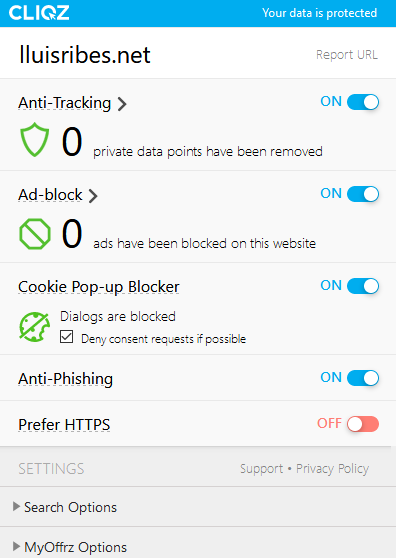<figcaption>Neta de tracistes</figcaption></figure>

Així i tot hi ha dos matisos. Un, si et subscrius, (cosa que t’animo), [ho fas a través del servei de FeedBurner](https://support.google.com/feedburner/answer/78982?hl=en), i FeedBurner és de Google encara que assegura que és un servei totalment gratuït i sense cap intenció de lucre…. Dos, quan navegues pel meu web sempre travesses una xarxa d’ordinadors d’una companyia americana que cotitza en borsa i que controla el 20% del que passa a Internet. Si vet aquí cobra sentit la navegació HTTPS i el negoci de la companyia no es basa a obtenir informació personal dels usuaris, controlar el 20% del trànsit és massa informació per no fer-ho d’amagat.

Al mateix temps altres tasques de manteniment s’han fet com la revisió de les còpies de seguretat, que continuen funcionant i la revisió de SEO.

### Conclusió

Una feinada. I no estic del tot segur que la part de contingut funcioni, però crec que durant els pròxims mesos aniré afinant les etiquetes i categories així com les fotografies. Avui m’he descarregat les meves 4.000 fotografies del meu compte de [Flickr](https://ca.wikipedia.org/wiki/Flickr) després d’una petició que he fet. Hi ha un bon grapat de fotos que m’agradaria tornar-les a mostrar. També he de donar-li volta a les gravacions que pujo dient poemes.

Però hi ha bona feina perquè mantinc **una web neta, lleugera, sota el meu control i sobretot conservant l’històric de quinze anys publicant**. I la diferència de to, de color, del contingut entre diferents etapes és un exercici interessant de mantenir.

Per acabar, una cita que vaig [publicar arran d’uns canvis que vaig fer el 2012](https://www.lluisribes.net/2012/02/12/lluisr-blogspot-com-ahora-es-blog-lluisribes-net/):

> “La tortuga pot parlar més del camí que la llebre”
> 
> [*Khalil Gibran*](https://es.wikipedia.org/wiki/Gibran_Jalil_Gibran)