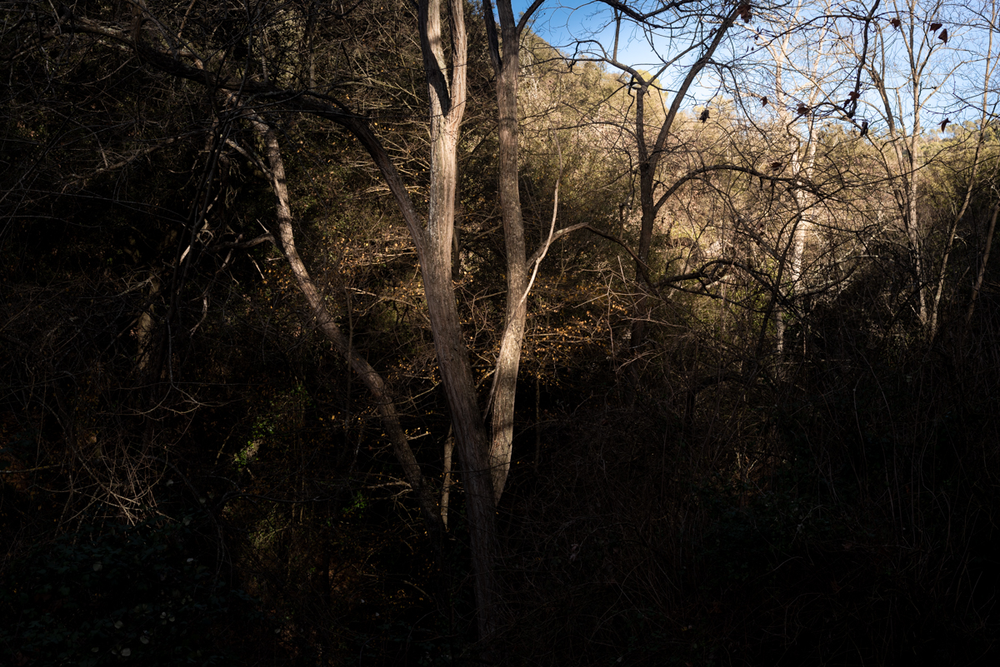

<figure><figcaption>Collserola, 2021 –<a href="https://creativecommons.org/licenses/by-nc-nd/3.0/" target="_blank" rel="noreferrer noopener">&nbsp;Lluís Ribes i Portillo (cc)</a></figcaption></figure>

Quan cauen les fulles

el cel és blau i els núvols continuen el seu viatge

mentre l’hivern t’abraça per fer-te companyia.