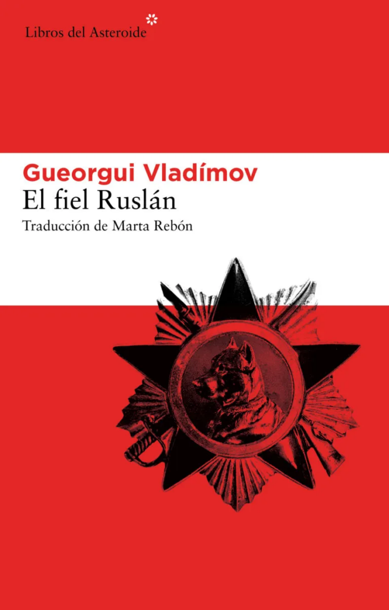

<figure></figure>

Aquest any acadèmic estic al curs de literatura russa de la [Xènia Dyakonovv](https://ca.wikipedia.org/wiki/X%C3%A8nia_Dyakonova) a la [Llibreria Nollegiu](https://www.nollegiu.com/cat/) i està passant unes lectures molt interessants per les nostres mans. I aquest, d’en Ruslan, m’ha agradat especialment.

Escrit per [Guergui Vladimov](https://ca.wikipedia.org/wiki/Gueorgui_Vlad%C3%ADmov) (Khàrkiv- Ucraïna, 1931), un gos pastor, anomenat Ruslan guarda d’un Gulag soviètic, ens narra la seva història en un moment on els camps de treball soviètics es desmantellen (probablement parlem dels anys 50-60, dic probablement perquè en Ruslan no sap de dates ni altres invents de les persones). Ruslan és noble, treballador i sobretot molt fidel al seu amo i a les normes.

És una lectura sorprenent, entranyable, de fàcil lectura (segurament gràcies a la bona traducció de [Marta Rebón](https://es.wikipedia.org/wiki/Marta_Reb%C3%B3n) de l’edició en castellà de [Libros del Asteroide](https://www.librosdelasteroide.com/)) però rabiosament actual, que ens posa al mirall de la nostra moral com a individu i com a col·lectiu.

Us la recomano.