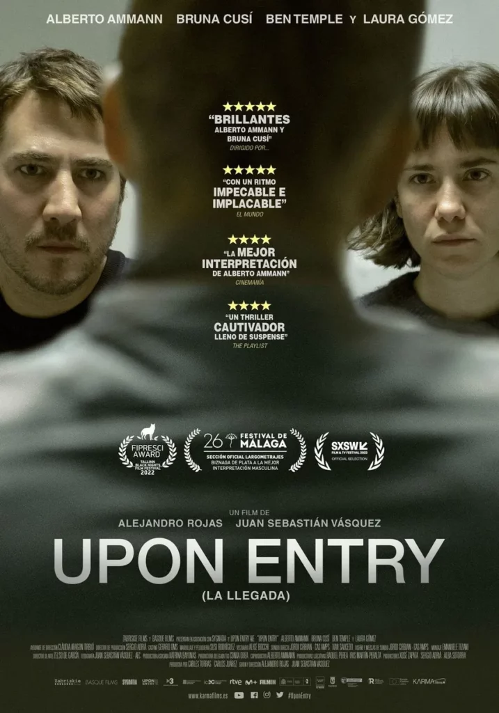

<figure></figure>

La segona recomanació del Festival de Cinema de Sant Sebastià 2023. A la selecció Made in Spain anava sense massa expectatives de veritat. Tan sols havia llegit el títol i una breu sinopsi.

Doncs bé, una pel·lícula que t’enganxa del principi al final. Senzilla, sense parafernàlies però interessant, sense fruites d’aigües amb un bon final. Rodona, i no cal que sigui una obra mestra.

> Una parella que decideixen emigrar als EUA, tenen tots els seus visats en ordre, però quan arriben al control de duana de l’aeroport de Nova York, la policia se’ls emporta per una entrevista més a fons per decidir si entren o no. I clar, quan hi ha mentides amagades, surten i vaja si surten…

He vist que la tindreu disponible a Filmin el 13 d’Octubre. No dubteu en veure-la per passar una bona estona.

Upon Entry, ver ahora en Filmin

Los ganadores del Goya Alberto Ammann y Bruna Cusí protagonizan una de las sorpresas de la temporada. Un asfixiante thriller en el control de inmigración de un aeropuerto estadounidense.