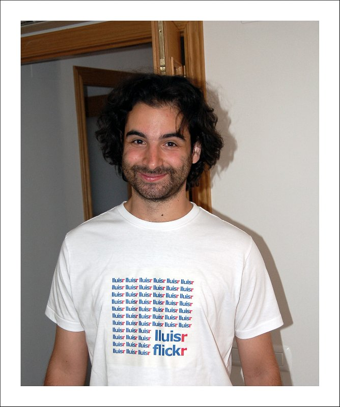

He recuperat totes les fotografies que tenia en el servei de fotografia Flickr i les he penjat aquí:

[**https://www.lluisribes.net/galeria/arxiu/**](https://www.lluisribes.net/galeria/arxiu/)

Són pràcticament 4000 fotografies de 2003 a 2014. Com molts sabreu, durant uns anys vaig estar-hi molt actiu en aquesta xarxa on vaig aprendre a fer fotografies. Per mi és avui en dia un arxiu amb molt valor fotogràfic per entendre l’evolució que he tingut en aquest camp que tant m’agrada. També és una mica un testimoni de la gent que vaig conèixer alguns d’ells que mantinc una gran amistat a dia d’avui i d’altres que tot haver-hi perdut el contacte van acompanyar-me en moltes aventures que vam compartir (per curiositat en aquest enllaç podeu veure algunes fotos que amics del Flickr em van fer a mi: [https://flickr.com/search/?text=lluisr&view\_all=1](https://flickr.com/search/?text=lluisr&view_all=1)). Tanmateix, un viatge de llocs on he viatjat.

És divertit i estrany alhora tornar a retrobar-se amb totes les fotografies, veure l’evolució en la temàtica dels continguts, les diferents tècniques així com càmeres i objectius emprats que fan parlar la imatge d’una forma o un altre.

Tota aquesta evolució es complementa en gran part amb els tallers de fotografia d’Óscar Molina que vaig fer durant cinc estius al Cabo de Gata. Aquests em van servir per llevar àncores i navegar pel meu compte per la immensitat del món de les imatges. Els tallers van finalitzar després de 25 anys, però l’[Òscar Molina](https://oscarmolina.com/) continua impartint seminaris dels que només us puc recomanar encaridament si voleu realment buscar la vostra veu a les fotos. Tanmateix, podeu llegir sobre aquests en els articles que vaig escriure en el meu bloc fent una cerca aquí:

[**Resultats de la cerca al bloc per a: cabo de gata**](https://www.lluisribes.net/?s=cabo+de+gata&asp_active=1&p_asid=2&p_asp_data=1&asp_gen%5B0%5D=excerpt&asp_gen%5B1%5D=content&asp_gen%5B2%5D=title&filters_initial=1&filters_changed=0&qtranslate_lang=0&current_page_id=5020)

Tornant a les meves fotos, per sort tinc l’original de totes guardades en les meves còpies de seguretat i revisant-les aquests dies recuperaré fotos que em semblen molt interessants i les tornaré a editar però ara des del meu ull fotogràfic d’avui.

Sense dubte, un aprenentatge d’un art que com tot, cal practicar i practicar per aprendre a dominar-lo: Mai s’arriba a dominar quelcom, però en el camí passen les coses més interessants.

<figure></figure>