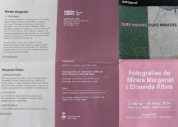
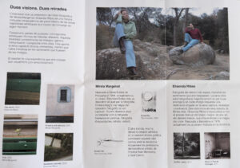
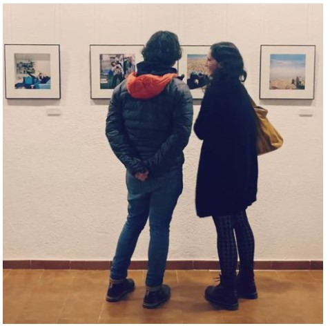

[Sant Celoni](https://santceloni.cat/) és una bonica vila als peus del Montseny, al Vallès Oriental. Durant aquest mes de febrer fins al 10 de març s’exposa l’exposició de fotografia “Dues Visions Dues Mirades” de la Mireia Margenat i la meva germana, l’Elisenda Ribes. L’exposició es realitza en un entorn de luxe com és [La Rectoria Vella](https://santceloni.cat/8414) de la vila i són al voltant de trenta fotografies exquisidament presentades.

Mireia Margenat presenta

-   **Al Descobert**: Diferents vessants que relaciona el paisatge humà amb la natura. Paisatge natural i paisatge cultural, una mostra de com ens relacionem amb el nostre entorn i amb nosaltres mateixos.

Elisenda Ribes presenta

-   **Camins interiors**: Què ens separa de l’exterior? Una fina capa de pell permeable que ens envolta to el cos i defineix el nostre espai. Un espai habitat per incerteses, veritats, pors, intuïcions, dubtes i molt més que no sempre es mostra ii podem trobar reflectit en el nostre entorn
-   **L.T.R.S.H.D.D.E.** : Los tránsitos revelados se harán desaparecer del entendimiento
-   **L’inescrutable**: L’inescrutable significació de la presència de l’amor

<figure data-wp-context="{ &quot;core&quot;:
				{ &quot;image&quot;:
					{   &quot;imageLoaded&quot;: false,
						&quot;initialized&quot;: false,
						&quot;lightboxEnabled&quot;: false,
						&quot;hideAnimationEnabled&quot;: false,
						&quot;preloadInitialized&quot;: false,
						&quot;lightboxAnimation&quot;: &quot;zoom&quot;,
						&quot;imageUploadedSrc&quot;: &quot;https://www.lluisribes.net/wp-content/uploads/2024/02/Exposicio_Sant_Celoni_Fotos_Dues_Visions_Dues_Mirades-2.jpg&quot;,
						&quot;imageCurrentSrc&quot;: &quot;&quot;,
						&quot;targetWidth&quot;: &quot;1000&quot;,
						&quot;targetHeight&quot;: &quot;713&quot;,
						&quot;scaleAttr&quot;: &quot;&quot;,
						&quot;dialogLabel&quot;: &quot;Imatge ampliada&quot;
					}
				}
			}" data-wp-interactive=""><button class="lightbox-trigger" type="button" aria-haspopup="dialog" aria-label="Amplia la imatge" data-wp-on--click="actions.core.image.showLightbox" data-wp-style--right="context.core.image.imageButtonRight" data-wp-style--top="context.core.image.imageButtonTop"><svg xmlns="http://www.w3.org/2000/svg" width="12" height="12" fill="none" viewBox="0 0 12 12"><path fill="#fff" d="M2 0a2 2 0 0 0-2 2v2h1.5V2a.5.5 0 0 1 .5-.5h2V0H2Zm2 10.5H2a.5.5 0 0 1-.5-.5V8H0v2a2 2 0 0 0 2 2h2v-1.5ZM8 12v-1.5h2a.5.5 0 0 0 .5-.5V8H12v2a2 2 0 0 1-2 2H8Zm2-12a2 2 0 0 1 2 2v2h-1.5V2a.5.5 0 0 0-.5-.5H8V0h2Z"></path></svg></button>
<button type="button" aria-label="Tanca" style="fill: #000" class="close-button" data-wp-on--click="actions.core.image.hideLightbox"><svg xmlns="http://www.w3.org/2000/svg" viewBox="0 0 24 24" width="20" height="20" aria-hidden="true" focusable="false"><path d="M13 11.8l6.1-6.3-1-1-6.1 6.2-6.1-6.2-1 1 6.1 6.3-6.5 6.7 1 1 6.5-6.6 6.5 6.6 1-1z"></path></svg></button>

<figure></figure>

<figure></figure>

</figure>

<figure data-wp-context="{ &quot;core&quot;:
				{ &quot;image&quot;:
					{   &quot;imageLoaded&quot;: false,
						&quot;initialized&quot;: false,
						&quot;lightboxEnabled&quot;: false,
						&quot;hideAnimationEnabled&quot;: false,
						&quot;preloadInitialized&quot;: false,
						&quot;lightboxAnimation&quot;: &quot;zoom&quot;,
						&quot;imageUploadedSrc&quot;: &quot;https://www.lluisribes.net/wp-content/uploads/2024/02/Exposicio_Sant_Celoni_Fotos_Dues_Visions_Dues_Mirades.jpg&quot;,
						&quot;imageCurrentSrc&quot;: &quot;&quot;,
						&quot;targetWidth&quot;: &quot;1000&quot;,
						&quot;targetHeight&quot;: &quot;702&quot;,
						&quot;scaleAttr&quot;: &quot;&quot;,
						&quot;dialogLabel&quot;: &quot;Imatge ampliada&quot;
					}
				}
			}" data-wp-interactive=""><button class="lightbox-trigger" type="button" aria-haspopup="dialog" aria-label="Amplia la imatge" data-wp-on--click="actions.core.image.showLightbox" data-wp-style--right="context.core.image.imageButtonRight" data-wp-style--top="context.core.image.imageButtonTop"><svg xmlns="http://www.w3.org/2000/svg" width="12" height="12" fill="none" viewBox="0 0 12 12"><path fill="#fff" d="M2 0a2 2 0 0 0-2 2v2h1.5V2a.5.5 0 0 1 .5-.5h2V0H2Zm2 10.5H2a.5.5 0 0 1-.5-.5V8H0v2a2 2 0 0 0 2 2h2v-1.5ZM8 12v-1.5h2a.5.5 0 0 0 .5-.5V8H12v2a2 2 0 0 1-2 2H8Zm2-12a2 2 0 0 1 2 2v2h-1.5V2a.5.5 0 0 0-.5-.5H8V0h2Z"></path></svg></button>
<button type="button" aria-label="Tanca" style="fill: #000" class="close-button" data-wp-on--click="actions.core.image.hideLightbox"><svg xmlns="http://www.w3.org/2000/svg" viewBox="0 0 24 24" width="20" height="20" aria-hidden="true" focusable="false"><path d="M13 11.8l6.1-6.3-1-1-6.1 6.2-6.1-6.2-1 1 6.1 6.3-6.5 6.7 1 1 6.5-6.6 6.5 6.6 1-1z"></path></svg></button>

<figure></figure>

<figure></figure>

</figure>

Podeu visitar l’exposició de Dijous a Dissabtes a la tarda (17h. a 20h. del vespre) i Diumenges i festius de 11.30h. a 13.30h. del migdia i de 17h. a 20h.

<figure data-wp-context="{ &quot;core&quot;:
				{ &quot;image&quot;:
					{   &quot;imageLoaded&quot;: false,
						&quot;initialized&quot;: false,
						&quot;lightboxEnabled&quot;: false,
						&quot;hideAnimationEnabled&quot;: false,
						&quot;preloadInitialized&quot;: false,
						&quot;lightboxAnimation&quot;: &quot;zoom&quot;,
						&quot;imageUploadedSrc&quot;: &quot;https://www.lluisribes.net/wp-content/uploads/2024/02/expo.jpg&quot;,
						&quot;imageCurrentSrc&quot;: &quot;&quot;,
						&quot;targetWidth&quot;: &quot;478&quot;,
						&quot;targetHeight&quot;: &quot;472&quot;,
						&quot;scaleAttr&quot;: &quot;&quot;,
						&quot;dialogLabel&quot;: &quot;Imatge ampliada&quot;
					}
				}
			}" data-wp-interactive=""><button class="lightbox-trigger" type="button" aria-haspopup="dialog" aria-label="Amplia la imatge" data-wp-on--click="actions.core.image.showLightbox" data-wp-style--right="context.core.image.imageButtonRight" data-wp-style--top="context.core.image.imageButtonTop"><svg xmlns="http://www.w3.org/2000/svg" width="12" height="12" fill="none" viewBox="0 0 12 12"><path fill="#fff" d="M2 0a2 2 0 0 0-2 2v2h1.5V2a.5.5 0 0 1 .5-.5h2V0H2Zm2 10.5H2a.5.5 0 0 1-.5-.5V8H0v2a2 2 0 0 0 2 2h2v-1.5ZM8 12v-1.5h2a.5.5 0 0 0 .5-.5V8H12v2a2 2 0 0 1-2 2H8Zm2-12a2 2 0 0 1 2 2v2h-1.5V2a.5.5 0 0 0-.5-.5H8V0h2Z"></path></svg></button>
<button type="button" aria-label="Tanca" style="fill: #000" class="close-button" data-wp-on--click="actions.core.image.hideLightbox"><svg xmlns="http://www.w3.org/2000/svg" viewBox="0 0 24 24" width="20" height="20" aria-hidden="true" focusable="false"><path d="M13 11.8l6.1-6.3-1-1-6.1 6.2-6.1-6.2-1 1 6.1 6.3-6.5 6.7 1 1 6.5-6.6 6.5 6.6 1-1z"></path></svg></button>

<figure></figure>

<figure></figure>

</figure>