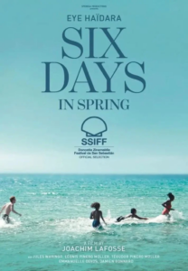

<figure></figure>

Mi primera película del festival del 2025, [Six Days in Spring](https://www.imdb.com/title/tt37964037/?ref_=fn_all_ttl_1) de la sección oficial. Mi puntuación: ⭐️⭐️☆☆☆.

Y es que no puedo esperar mucho de una película belga-franco-luxemburguesa que cuenta las vacaciones de Sana, una mujer de clase baja, separada y con dos mellizos a su cargo, que junto a su nuevo novio, al no encontrar hotel, decide instalarse en la lujosa villa de la acaudalada familia de su ex en la Riviera francesa.

La verdad es que se agradece que el director Jochim Lafosse no quisiera profundizar en el drama de las historias y que sea un largometraje de 90 minutos porque sino hubiera caído una de las dos estrellas que quedan de la puntuación sin duda.

A su favor, una actuación buena de Eye Haïdara (Sana), los planos, la ambientación en la soleada en la Riviera y la fotografía e iluminación de la casa aunque muy forzada por el hecho que deciden no usar la electricidad para no llamar la atención y llenan la casa de velas (¿esto se le ocurrió al guionista o al director de fotografía?)

La película se deja ver, pero no sorprende para nada, no emociona y pronto se olvida. Vamos a ver qué hace en los premios.