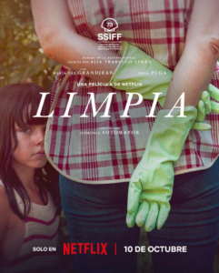

<figure></figure>

Segunda película que veo en el festival, [Limpia](https://www.imdb.com/title/tt34682204/?ref_=nm_flmg_job_1_cdt_img_1), de la sección Latinos . Mi puntuación ⭐️⭐️☆☆☆

Esta película, dirigida por Dominga Sotomayor y producida por Netflix, está basada en la novela Limpia (2022) de la escritora chilena Alia Trabucco Zerán. Narra la historia de Estela, una mujer que trabaja como empleada doméstica y cuidadora de la hija de una familia adinerada. A lo largo del filme se van desentrañando sus vínculos con el trabajo, con los suyos —incluida su madre, que vive a la distancia— y, sobre todo, la relación cada vez más íntima y compleja que establece con la pequeña Julia, una niña desatendida por unos padres absorbidos por sus responsabilidades laborales.

La película cuenta con buenos diálogos y metáforas potentes (me encantan esos pequeños bombardeos de baladas latinas populares que expresan cómo florece en Estela su pasión), y tanto Rosa Puga, en el papel de Julia, como María Paz Grandjean, como Estela, entregan actuaciones notables. Pero qué manera de arruinarlo todo con un final forzado y sin sentido. Y es que, tras documentarme un poco, descubrí que hay ciertos cambios en el guion respecto a la novela original, y precisamente esos giros seguramente no le han sentado bien a la historia (¿habrá tenido algo que ver Netflix…?).

La película es larga, pero no se hace pesada. La verdad, podría haberse ganado media estrella más —o incluso una entera— si el final hubiera estado mejor resuelto: ya fuera más fiel al libro (que me está llamando la atención) o, por el contrario, más arriesgado e impactante: Un cierre más bestia, más dramático, de esos que te dejan traumatizado al salir del cine, pensando que en la persona más sencilla y corriente también puede germinar la semilla de una bestia.