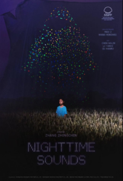

<figure></figure>

Primera gema que me topo en el festival este año. La película china [Nighttime Sounds](https://www.sansebastianfestival.com/2025/secciones_y_peliculas/new_directors/7/733164/es), de la sección “New Directors” y se va a llevar ⭐️⭐️⭐️⭐️☆: porque es onírica, bonita, cuenta bien una historia y sobre todo, es honesta.

Es la segunda película del director chino Zhang Zhongchen, que esta vez nos brinda un relato alrededor de la figura de la madre. Se ambienta en el noroeste de China, en una aldea rural donde se alzan estatuas milenarias de la dinastía Song. Allí, Qing conocerá a una misteriosa niña que busca a su madre y, juntas, emprenderán un camino marcado por pequeñas aventuras.

Es sin duda una película para ver en cine: la fotografía y el sonido son magníficos. Pero porque no en casa, tranquilo lejos de las pantallas de las redes sociales, por ejemplo en una mañana relajada o en un rato descansado del fin de semana. Pero más allá de la técnica, la historia, sencilla en apariencia, esconde un secreto que es guardado con delicadeza hasta el final. Las interpretaciones de la niña Qinq (Halin Chen) y su madre (Yanxi Li) acompañan la fantástica historia poética como así algunas de sus bellas escenas. Pero no os engañéis, hay muchos momentos que afloran los conflictos de la mujer en la sociedad rural china, así como los de una niña lejos de la disciplina que caracteriza su generación que nos engancharán a lo largo de la filmación.

La sesión a la que asistí pudimos compartir con todo el equipo de la película una sesión abierta de preguntas y respuestas y salieron anécdotas como la del título. En chino, el original es **《你得眼睛比太阳明亮》** (*Tus ojos son más brillantes que el sol*), mientras que para el mercado internacional se optó por *Nighttime Sounds*. El propio director explicó que eligió finalmente esa frase por ser el estribillo de la canción que se repite a lo largo de la película: *[Red River Valley](https://www.youtube.com/watch?v=hrCK_EVjcZ0)*, un clásico del country que en los años 50 fue adaptado al chino hasta convertirse en canción popular.

¿Y no os parece curioso que una canción country americana, adaptada en China en los años cincuenta hasta convertirse en popular, sea el eje alrededor del cual gira toda la película? Y es que China no solo se ha convertido en el país que fabrica los mejores coches eléctricos del mundo, sino que también muestra un talento joven prometedor capaz de dar forma a películas sólidas y con gran proyección.