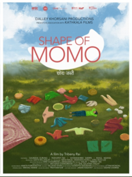

<figure></figure>

[Shape of Momo](https://www.sansebastianfestival.com/2025/secciones_y_peliculas/new_directors/7/732432/es), de la sección New Directors, película india aunque ambientada en Nepal y en nepalí está siendo una de las pelis que más me ha sorprendido en positivo y sin reparo le doy un ⭐️⭐️⭐️☆☆.

Quizá la vi en el momento justo de una tranquila mañana: una película ambientada en una zona rural del Himalaya, con actores nepalíes que ofrecen interpretaciones sencillas y creíbles, y una historia bien contada que contrapone la vida moderna con la rural sin necesidad de estridencias

Todo gira alrededor de Bishnu, una mujer que tras dejar su empleo en Delhi, regresa a su aldea en Sikkim para convivir con su abuela, su madre y su hermana embarazada. Allí también conoce a un arquitecto que proyecta hoteles turísticos (paryatak hoṭal), un chico también que estuvo viviendo años en Delhi. Bisnhu intenta imponer sus ideas modernas en un entorno marcado por las tradiciones y ello crea tensiones que dará lugar a conflictos y situaciones en las que, pese a su fortaleza, aprenderá que a veces también hay que dar un paso atrás.

En definitiva, no hay magia ni espíritus, pero sí tradiciones que actúan como tales. Tampoco es una película en la que te sientes anclado en otra era: lo moderno también está presente, y los móviles o las pantallas aparecen desde el inicio como un utensilio más en la vida rural de esa comunidad, igual que lo pueda ser la olla de hierro donde se cocina un ***momo***.

Vedla si tenéis ocasión. No alcanza las cuatro ni cinco estrellas, lo sé… quizá porque no hay un apartado que brille de forma sobresaliente, pero justamente ese equilibrio es lo que la convierte en una de mis recomendaciones preferidas.