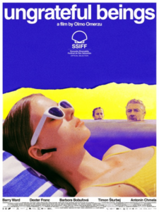

<figure></figure>

Ay, ay, ay… una mala película, pero mala de verdad. ⭐️☆☆☆☆ *Ungrateful Beings*, presentada en la Sección Oficial del festival, no se sostiene por ningún lado.

La trama sigue a una familia checa de padres separados (sí, otra vez, como en *[Six Days in Spring](https://www.lluisribes.net/2025/09/20/ssiff-73-six-days-in-spring/)*) que viaja de vacaciones al Adriático. La protagonista, la adolescente y hermana mayor de dos, sufre trastornos alimentarios severos, pero gracias a un romance veraniego con un chulito más bien descafeinado, su actitud frente a la enfermedad mejora. El padre se aferra a ese frágil equilibrio durante toda la película, aunque entre tanto se suceden tramas absurdas: algunas se quedan a medio cocinar, otras directamente no se explican, y unas pocas logran provocar una risa involuntaria, lo único que justifica la única estrella de mi valoración.

Las interpretaciones son flojas. En parte puede deberse a que los dos personajes jóvenes están interpretados por actores sin apenas experiencia (Dexter Franc y Antonín Chmela), pero más que culpa de ellos parece producto de un guion disparatado y de una dirección sin pulso ni fe en el proyecto. Barry Ward, actor con recorrido que encarna al padre, debería haber aportado el peso dramático para equilibrar la balanza, pero aquí se le ve condescendiente con el tono fallido general.

*(Atención: spoilers a discreción)* La película acumula momentos insoportables: el cliché de la reconciliación de los padres gracias a los acontecimientos, un crimen vinculado directamente con los protagonistas que ni se comienza a resolver por una policía que aparece y desaparece, un infarto de origen misterioso (médicamente inexplicable, aunque el espectador sabe que es por desamor) que lleva a la prota al hospital y se recupera mágicamente con un “simple” mensaje de WhatsApp del amante desaparecido, o la aparición del hermano, personaje irrelevante que solo sirve para llamar a la policía en el desenlace (no os descubro si aparece la policía o no), justo en una escena donde, como en *Six Days of Spring*, un niño escondido tras la puerta escucha las conversaciones de los adultos.

Lo siento, pero no. Dicho todo esto, solo deseo que el equipo de la película —y en especial los actores más jóvenes— haya vivido un rodaje interesante, porque el cine es un oficio tan exigente como apasionante. Ojalá afronten proyectos más sólidos que les permitan crecer y continuar sus carreras con mejores oportunidades.