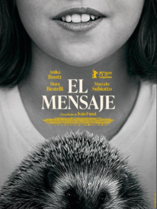

<figure></figure>

*Road movie* en blanco y negro, con planos de paisajes preciosos e historia intimista: todo esto nos ofrece *[El mensaje](https://www.sansebastianfestival.com/secciones_y_peliculas/7/730928/es)*, de Iván Fund, en la sección Horizontes Latinos. Pero a pesar de ello, mi puntuación se queda así: ⭐️⭐️☆☆☆

La película se hace larga y no termino de entenderla. Quizá sea injusto decir que, si hubiera acabado en un momento concreto, justo cuando la niña revela el mensaje de un pájaro para los protagonistas, me habría encantado. Habría sido una película que no me habla de nada en particular, pero que estéticamente me gusta en todos los sentidos, hasta desembocar en un final con un mensaje sencillo pero profundo y que le da sentido. Qué bueno habría sido… pero habría sido otra película. Y como continúa más allá, cuando llega el final, sigo sin saber adónde me ha llevado ese viaje.

La sinopsis: una niña, Anika, y dos familiares suyos recorren en furgoneta distintas aldeas. Anika, con el don de hablar con los animales, actúa como mensajera entre ellos y sus dueños.

Pero siento que algo me he perdido. No me imagino cómo una película con tanto potencial ha podido extraviarse al final en las estepas inmensas del cine.