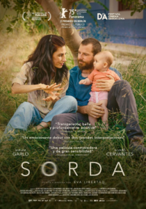

<figure></figure>

Nos ponemos serios. [Sorda](https://www.sansebastianfestival.com/secciones_y_peliculas/7/730858/es), película que llega del Festival de Málaga tras ganar la Biznaga de Oro a la mejor película española y dos Biznagas de Plata a las mejores interpretaciones femenina (Miriam Garlo) y masculina (Álvaro Cervantes). Mi puntuación: ⭐️⭐️⭐️⭐️☆. Sección Made in Spain

Es una película redonda, con interpretaciones sólidas, que nos habla de la maternidad de una mujer con una gran particularidad: es sorda. La historia nos invita a acompañarla desde el embarazo hasta el primer año de su bebé, en un viaje compartido con su pareja, sus padres y sus amigos, lleno de momentos complicados.

Me gusta porque también aborda otros temas, como el sentimiento de pertenencia a una comunidad o el derecho de una madre a decidir en qué comunidad crecerá su hijo.

Como anécdota, la directora Eva Libertad (que nos acompañó en el pase de la película) es hermana de Miriam Garlo, la actriz protagonista, quien es precisamente sorda. Esa relación personal se deja notar sin lugar a dudas en la sensibilidad con la que se explica esta historia.