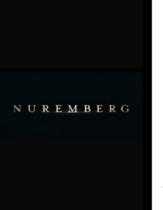

Primer blockbuster de los tres que vi en el festival y sin duda el que me gustó más. Le doy ⭐️⭐️⭐️☆☆.

<figure></figure>

Interpretada por Russell Crowe y Rami Malek, la película se centra en la figura del psiquiatra militar encargado de atender a los prisioneros nazis que iban a ser juzgados en Núremberg, especialmente a Hermann Wilhelm Göring. Hay que reconocer que la cinta engancha: son más de dos horas que, sinceramente, se me hicieron cortas y en ningún momento tuve la tentación de levantarme de la butaca del cine Principal.

En el apartado técnico, la película está impecablemente realizada: buena factura visual, interpretaciones convincentes de los personajes clave y un ritmo narrativo que conduce bien al espectador. Ahora bien, conviene advertirlo: si esperas una trama centrada en la relación entre el médico y Göring con la intensidad psicológica de *El silencio de los corderos* entre Clarice Starling y Hannibal Lecter, no la encontrarás. Tampoco es una oportunidad para profundizar en el proceso de Núremberg, ya que lo trata de forma bastante superficial, resumida y sin aportar elementos nuevos. De hecho, incluso el título me parece poco acertado, casi engañoso.

La película además se permite algunas licencias dramáticas. Por ejemplo, en una conversación entre Göring y Kelley, el primero intenta desacreditar al psiquiatra relativizando los crímenes nazis y comparándolos con las bombas atómicas lanzadas por Estados Unidos sobre Japón. Este episodio no aparece en los cuadernos de notas de Kelley, por lo que todo apunta a una invención para dramatizar y acercar el relato a sensibilidades más actuales.

Algo parecido ocurre en el tramo final. Una vez concluido el juicio, vemos a Kelley en un estudio de radio advirtiendo que los futuros dictadores no llegarán con uniforme militar ni con chaquetas de cuero negras, sino bien vestidos con traje y corbata, y que no dudarán en seducir a la mitad de la población para después someter al resto. La referencia, evidentemente contemporánea, arrancó aplausos en la sala, pero lo cierto es que Kelley nunca pronunció esas palabras en la radio. Sí es cierto, sin embargo, que en su libro *22 Cells in Nuremberg* dejó escrita una advertencia que resuena con esa idea y que resulta muy reveladora:

> “Estos hombres no estaban locos. Eran, con pocas excepciones, notablemente normales desde un punto de vista psiquiátrico. Sus crímenes no fueron producto de la locura, sino de una ideología fanática y de la búsqueda despiadada del poder. Creer que solo los locos pueden cometer tales actos es cegarnos ante la realidad de que hombres corrientes, en ciertas circunstancias, pueden convertirse en instrumentos de un mal extraordinario.”

En resumen: una película que, pese a sus carencias, entretiene y está bien construida.